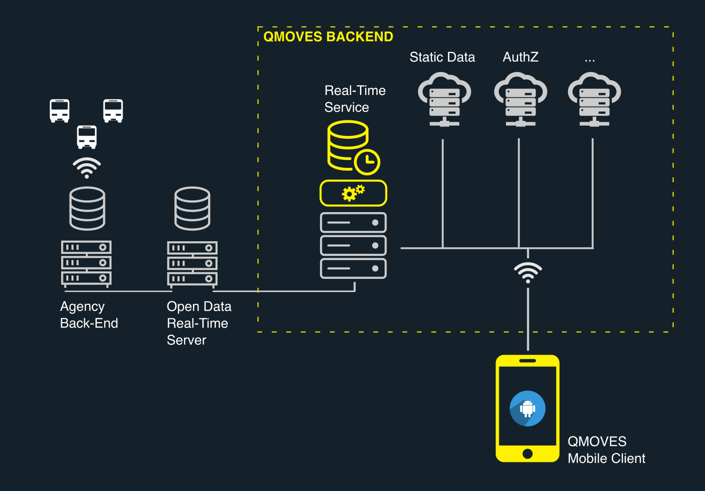
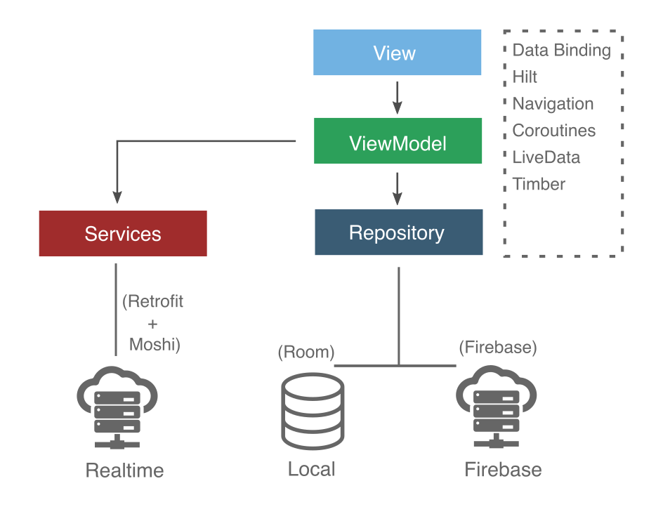

# qmoves-android

Qmoves Mobile app aims to provide all the information to move around a city by bus, subway, tram, etc.  The main features are:

- Shows the list of available transports.
- Schedules of any stops.
- Calculates the best route to a destination.
- Discover the routes of all bus, subway, or tram lines.
- Includes the list of night lines.
- Quickly access the favorite stops and consult their schedules.
- Check the latest news to be always informed of any incidence affecting your city's public transit.

##  System Overview 

The mobile client is part of a larger solution that involves a backend with several services.

##  Mobile App Architecture 

The mobile application is architecting following the [Clean Architecture](https://blog.cleancoder.com/uncle-bob/2012/08/13/the-clean-architecture.html) guidelines. 

**MVVM** pattern is used across all the UI to keep a loose coupling between the views and the rest of the app components. UI layouts take advantage of the **Data Binding** library to observe changes in **LiveData** properties exposed by the ViewModels.

ViewModels use **Kotlin Coroutines** for asynchronous operations such as fetching real-time information, querying the repository, etc.

The app uses the Jetpack **Navigation** library to build the navigation graph, so transitions between different pages and arguments passing can be easily resolved by using actions. 

Finally, **Hilt** is the library used for dependency injection. 

## Persistence Layer

For the implementation of the persistence layer, the **Repository** is the pattern of choice.

The local persistency layer is implemented using the **Room** library to abstract away the underlying local SQLite database.

The remote component of the repository uses the Firebase library to fetch the transit data from a Firebase Storage instance.

The model objects used by the persistence layer are mapped to the domain entities used in the upper layers to avoid coupling the business logic to a specific persistency library.

To enhance the logging mechanism, **Timber** is used as logger.

## Realtime Information

Real-time information is fetched from a proprietary REST service. **Retrofit and Moshi** are the libraries used by the app to interact with this service.  

## Testing

The testing framework is **Junit4** along with **Mockk** for mocking dependencies. 

**Truth** is the library of choice for asserting the test results with a fluent style. 